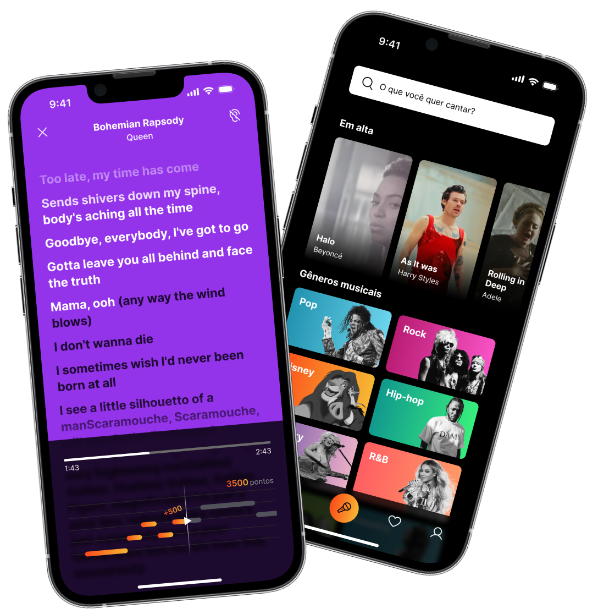
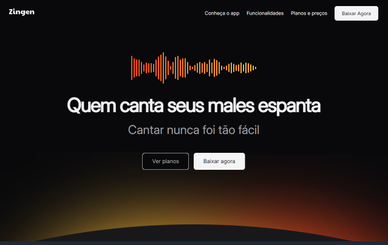

<div align="center">


# 🎤 Zingen — Landing Page

> _Quem canta seus males espanta._

Landing page **moderna, responsiva e elegante** para o aplicativo de Karaok꺺 **Zingen**. Desenvolvida com HTML5 semântico e CSS3 puro, com foco em performance, acessibilidade e design pixel-perfect para qualquer dispositivo.

<br/>

[](https://developer.mozilla.org/pt-BR/docs/Web/HTML)
[](https://developer.mozilla.org/pt-BR/docs/Web/CSS)
[](https://fonts.google.com/)
[](#)

<br/>

[Ver Projeto ao Vivo](#) · [Reportar Bug](https://github.com/martoxm/lading-page-app/issues) · [Sugerir Funcionalidade](https://github.com/martoxm/lading-page-app/issues)

</div>

---

## 📸 Demonstracao

<div align="center">



|                     Desktop                      |                     Mobile                      |
| :----------------------------------------------: | :---------------------------------------------: |
|  |  |

</div>

---

## 🚀 Sobre o Projeto

O **Zingen** é um aplicativo de Karaokê que usa Inteligencia Artificial para remover a voz original das músicas e gerar a maior biblioteca de Karaokê do mercado. Esta landing page foi criada para apresentar o app de forma moderna e persuasiva, com seccoes de funcionalidades, planos e call-to-action de download.

Além disso, todo o design foi desenvolvido previamente no Figma, servindo como guia visual para a construção fiel da interface.

O projeto foi desenvolvido como prática de HTML5 semântico, CSS3 responsivo e boas práticas de acessibilidade web (atributos aria-label, hierarquia de headings, roles semânticos).

---

## 🛠️ Tecnologias Utilizadas

<div align="center">

|     Tecnologia     | Uso                                         |
| :----------------: | :------------------------------------------ |
|     HTML5 logo     | Estrutura semântica da página             |
|     CSS3 logo      | Estilizacao, layout e responsividade        |
|    Google Fonts    | Tipografia (Poppins, Inter, Archivo, Alice) |
|    SVG / Assets    | Icones e imagens vetoriais otimizados       |
| CSS Grid & Flexbox | Sistema de layout moderno e responsivo      |

</div>

---

## ✨ Recursos do Projeto

- **Design 100% Responsivo** - Adaptado para PC, tablet e celular via media queries e unidades relativas
- **HTML Semantico** - Uso correto de header, section, footer, nav e atributos de acessibilidade
- **Sistema de Design Consistente** - Variaveis CSS, espacamentos padronizados e paleta de cores coesa
- **Mobile-First** - Construdo priorizando a experiencia em dispositivos moveis
- **Performance Otimizada** - Sem dependencias externas de JavaScript; carregamento leve e rapido
- **Tipografia Refinada** - Combinacao de fontes Google para hierarquia visual clara
- **Seccao de Cards** - Cards de funcionalidades e planos com layout em grid responsivo
- **Seccao de Planos** - Tres planos de preco (Gratis, Premium e Familia) destacados visualmente
- **CTAs de Download** - Botoes direcionados para Apple Store e Play Store
- **Navegacao Suave** - Links de ancora para as seccoes da página

---

## 📂 Estrutura de Pastas

```
lading-page-app/
│
├── index.html              # Página principal - estrutura HTML completa
│
├── style/
│   └── index.css           # Todos os estilos: reset, variaveis, layout, responsividade
│
├── assets/
│   ├── logo.svg            # Logotipo Zingen
│   ├── music-bars.svg      # Icone animado da hero section
│   ├── smartphones.png     # Imagem mockup dos smartphones
│   ├── button-apple.svg    # Botao Apple Store
│   ├── button-play-store.svg # Botao Google Play
│   ├── Tela 1.png          # Screenshot do app (card comunidade)
│   ├── Tela 2.png          # Screenshot do app (card gamificado)
│   ├── Tela 3.png          # Screenshot do app (card letras)
│   └── icons/
│       ├── MagicWand.svg
│       ├── GameController.svg
│       ├── MicrophoneStage.svg
│       ├── UsersThree.svg
│       └── MusicNotes.svg
│
└── .gitignore
```

---

## ⚙️ Como Rodar Localmente

Este projeto não requer nenhuma dependencia, servidor ou build - é HTML + CSS puro!

### Opcao 1 - Abrir direto no navegador

```bash
# 1. Clone o repositorio
git clone https://github.com/martoxm/lading-page-app.git

# 2. Acesse a pasta do projeto
cd lading-page-app

# 3. Abra o arquivo index.html no seu navegador
# Windows
start index.html

# macOS
open index.html

# Linux
xdg-open index.html
```

### Opcao 2 - Live Server (recomendado para desenvolvimento)

Se você usa o VS Code, instale a extensão Live Server e clique em Go Live na barra inferior.

```bash
# Ou use o npx serve para um servidor local rapido
npx serve .
```

---

## 🤝 Contribuicao

Contribuicoes sao bem-vindas! Se você tem uma sugestao para melhorar este projeto, siga os passos abaixo:

1. **Fork** este repositorio
2. Crie uma branch para sua feature: `git checkout -b feature/minha-melhoria`
3. Faça suas alterações e commit com uma mensagem descritiva: `git commit -m "feat: adiciona animacao na hero section"`
4. Faça o push para a sua branch: `git push origin feature/minha-melhoria`
5. Abra um **Pull Request** detalhando o que foi alterado

> Siga o padrao Conventional Commits para as mensagens de commit.

---

---

<div align="center">

Feito com por **Gabriel Martorelli**

[GitHub](https://github.com/martoxm)

⭐ Se este projeto te ajudou, deixa uma estrela no repositorio!

</div>
